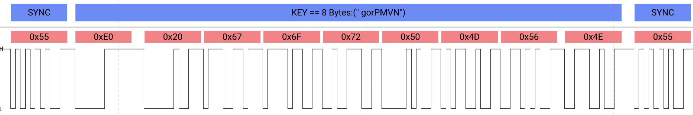

# UPDI Decoding Samples

## MPLAB Software

<details>
  <summary>MPLAB PICKIT 5, Debugger Refresh<p></p></summary>
  
  
  ```
  STCS CTRLB = 0x08 (NACKDIS)
  LDCS STATUSA == 0x20 (UPDIREV=0x02)
  LDCS CTRLA == 0x00 (GTVAL=128_CYCLE)
  STCS CTRLA = 0x03 (GTVAL=16_CYCLE)
  LDCS STATUSA == 0x20 (UPDIREV=0x02)
  KEY SIB = 32 Bytes:("tinyAVR P:0D:0-3M2 (00.59B15.0)")
  LDCS STATUSA == 0x20 (UPDIREV=0x02)
  LDCS ASI_CTRLA == 0x03 (UPDICLKSEL=4MHZ_UPDICLK)
  STCS ASI_CTRLA = 0x01 (UPDICLKSEL=16MHZ_UPDICLK)
  LDCS STATUSA == 0x20 (UPDIREV=0x02)
  LDCS ASI_SYS_STATUS == 0x82 (UNKNOWN_BIT_8 UNKNOWN_BIT_2)
  STCS ASI_RESET_REQ = 0x59 (RESET)
  KEY == 8 Bytes:(" gorPMVN")
  LDCS ASI_KEY_STATUS == 0x10 (NVMPROG)
  STCS ASI_RESET_REQ = 0x59 (RESET)
  LDCS ASI_SYS_STATUS == 0xA3 (UNKNOWN_BIT_8 UNKNOWN_BIT_2 RSTSYS NVMLOCK)
  STCS ASI_RESET_REQ = 0x00 (RUN)
  LDCS ASI_SYS_STATUS == 0x21 (RSTSYS NVMLOCK)
  LDCS ASI_SYS_STATUS == 0x01 (NVMLOCK)
  LDCS ASI_SYS_STATUS == 0x08 (NVMPROG)
  ST PTR = Word:0x0011
  ACK
  REPEAT 0x02
  LD *(PTR++) == Byte:0x1E
  LD *(PTR++) == Byte:0x94
  LD *(PTR++) == Byte:0x21
  LDS Word:0x010F == (Byte:0x0F)
  BREAK
  STCS ASI_RESET_REQ = 0x59 (RESET)
  STCS ASI_RESET_REQ = 0x00 (RUN)
  LDCS CTRLB == 0x08 (NACKDIS)
  STCS CTRLB = 0x0C (NACKDIS CCDETDIS)
  ```
</details>
